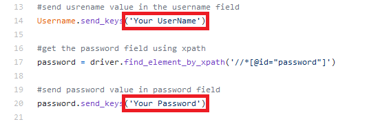
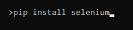

# GitHub-Automation
This is the repository of Github Automation using python. 
<strong>Do you want to make Github repositary with just single command line. Well, then you are at right place. Just follow the instruction given below</strong> 

# Let's Start
<ol>
  <li>Clone the repo in your machine</li>
  <li>Write Your Github User Name in the place of UserName</li>
  <li>Write Your Github password in the place of Password</li>
  <li>Save the script</li>
 </ol>

# Things You Need For this automation
<strong>1. Selenium</strong> 
<strong>2. Chrome webdriver</strong> 

# How To Get Selenium
Simply just do <strong>"pip install selenium"</strong> in your commande line prompt (make sure you have installed the python in your computer)

# How To Get Chrome Webdriver
<h3>=>To get chrome web driver you have to install chocolatey package manager</h3>

<h5>=>Steps to Install chocolatey/choco on Windows 10</h5>
<ol>
<li>Click Start and type <strong>powershell</strong></li>

<li>Right-click Windows Powershell and choose <strong>Run as Administrator</strong> (make sure it is on administration mode)</li>

<li>Paste the following link command into Powershell and press enter: <strong>Set-ExecutionPolicy Bypass -Scope Process -Force; `iex ((New-Object System.Net.WebClient).DownloadString('https://chocolatey.org/install.ps1'))</strong></li>

<li>Answer Yes when prompted</li>

<li>Close and re-open an elevated PowerShell window to start using choco</li>
</ol>

<h3>=>Now we are ready to install chrome driver</h3>
<ol>
<li>open your commande prompt and <strong>run it as administration</strong></li>

<li>write<strong>choco install chromedrive r</strong> and press enter</li>

<li>It will get download</li>
</ol>

How ever if you have any problem you can go to this link for help: <link>https://chocolatey.org/docs/installation#more-install-options</link>

# And you are good to go!!!! 

Make sure you put this script file in very conveniant drictory of system So, you dont have to write long cd commands to choose the directory. 

Go to your script directory location in cmd and just write this command <strong>"python.exe  Github-auto.py"</strong> and hit the enter button. 
<strong>BOOM!! You have just created a new github repo with just single command line!!</strong> 
  
  <h1>Happy Automation!!!!! :)</h1>
