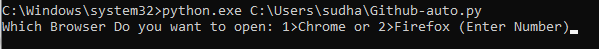

# GitHub-Automation
This is the repository of Github Automation using python. 
<strong>Do you want to make Github repository with just single command line. Well, then you are at right place. Just follow the instruction given below</strong> 

# Let's Start
<ol>
  <li>Clone the repo in your machine</li>
  <li>Save the script in a convenient location</li>
  <li>Write Your Github User Name in the place of UserName</li>
  <li>Write Your Github password in the place of Password </li>
  <li>Write path of dirver loaction in executable_path </li>
  <li>Save The file</li>
 </ol>

# Things You Need For this automation
<strong>1. Selenium</strong> 
<strong>2. Chrome webdriver</strong> 
<strong>3. Firefox webdriver</strong> 

# How To Get Selenium
Simply just do <strong>"pip install selenium"</strong> in your commande line prompt (make sure you have installed the python in your computer)

# How To Get Chrome Webdriver
<h3>=>To get chrome web driver you have to install chocolatey package manager</h3>

<h5>=>Steps to Install chocolatey/choco on Windows 10</h5>
<ol>
<li>Click Start and type <strong>powershell</strong></li>

<li>Right-click Windows Powershell and choose <strong>Run as Administrator</strong> (make sure it is on administration mode)</li>

<li>Paste the following link command into Powershell and press enter: <strong>Set-ExecutionPolicy Bypass -Scope Process -Force; `iex ((New-Object System.Net.WebClient).DownloadString('https://chocolatey.org/install.ps1'))</strong></li>

<li>Answer Yes when prompted</li>

<li>Close and re-open an elevated PowerShell window to start using choco</li>
</ol>

<h3>=>Now we are ready to install chrome driver</h3>
<ol>
<li>open your commande prompt and <strong>run it as administration</strong></li>

<li>write<strong>choco install chromedrive r</strong> and press enter</li>

<li>It will get download</li>
</ol>

How ever if you have any problem to download chocolatey you can go to this link for help: <link>https://chocolatey.org/docs/installation#more-install-options</link> 
And if you have problem regarding chrome driver you can go to this link for help <link>https://github.com/SeleniumHQ/selenium/wiki/ChromeDriver</link>

# How to get Firefox Web Driver

<ol>
  <li>Go to this link to download the Firefox web driver <link>https://github.com/mozilla/geckodriver/releases</link></li>
  <li>Scroll down and select the suitable web driver version for your system</li>
  
  <li>Download it</li>
  <li>Extract the zip file in a convenient location of your system</li>
 </ol>

# And you are good to go!!!! 
<ol>
<li>Make sure you put this script file in very conveniant drictory of system So, you dont have to write long cd commands to navigate in the directory</li>

<li>Open the command prompt as administrator</li>

<li>Just write this command in your command prompt <strong>"python.exe  C: Script Loction path\Github-auto.py"</strong> and hit the enter button.</li>

<li>Choose the browser that you want to open for Github</li>

</ol>
<strong>BOOM!! You have just created a new github repo with just single command line!!</strong> 
  
  <h1>Happy Automation!!!!! :)</h1>
